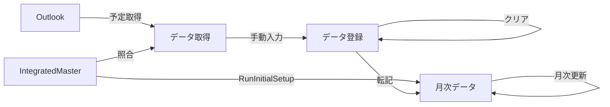

# LS入力システム 要件定義書

最終更新: 2026-02-24 / 作成: JJ-07

## 1. 概要
本システムは、Outlook の予定を Excel に取得し、統合マスタで照合した分類・推奨値を参考に日々の実績を入力・集計して「月次データ」シートへ転記する業務支援マクロ群です。目的は予定転記の省力化、入力ミスの削減、作番×作業コード軸での月次集計の標準化です。統合マスタ `tblIntegratedMaster` に分類ロジックと推奨値を集約し、予定取得・初期設定・転記処理で共通利用します。【F:LS入力/ModIntegratedMaster.bas†L62-L239】【F:LS入力/ModGetOutlookSch.bas†L1-L307】【F:LS入力/ModInitialSetup.bas†L1-L214】

### システム構成
| モジュール / 要素 | 主な役割 |
| --- | --- |
| ModAppConfig | シート名・列番号・列追加ポリシーなどの共有定数を提供します。【F:LS入力/ModAppConfig.bas†L1-L56】 |
| ModCommonUtils | 画面更新制御、シート保護の解除・復元、対象日取得、エラー表示を共通化します。【F:LS入力/ModCommonUtils.bas†L1-L108】 |
| ModIntegratedMaster | 統合マスタの雛形生成・検証・読込・照合補助を担います。【F:LS入力/ModIntegratedMaster.bas†L62-L421】 |
| ModInitialSetup | 統合マスタの内容を月次ヘッダーとプルダウンに反映します。【F:LS入力/ModInitialSetup.bas†L1-L214】 |
| ModGetOutlookSch | Outlook 予定の取得と統合マスタ照合結果の出力を行います。【F:LS入力/ModGetOutlookSch.bas†L1-L307】 |
| ModDataTransfer | 作番×作業コードの時間集計と月次シートへの転記・重複処理・結果通知を行います。【F:LS入力/ModDataTransfer.bas†L229-L398】 |
| ModDataClear | 取得・登録シートの入力値を一括クリアします。【F:LS入力/ModDataClear.bas†L36-L108】 |
| ModMonthlyMaintenance | 月次シートの転記領域を初期化し、対象月のカレンダーを再生成します。【F:LS入力/ModMonthlyMaintenance.bas†L1-L152】 |
| ModUIButtonSetup | 操作ボタンの配置と入力規則の再設定を自動化します。【F:LS入力/ModUIButtonSetup.bas†L1-L148】 |
| ダブルクリック削除r1 | データ登録シート B 列ダブルクリックで該当行をクリアします。【F:LS入力/ダブルクリック削除r1.cls†L22-L146】 |

## 2. 対象範囲（スコープ）
- 対象ブック: `LS入力r1.xlsm`
- 対象シート: 「データ取得」「データ登録」「月次データ」「統合マスタ」「要望・提案」
- 対象マクロ:
  - 予定取得: `ExecuteOutlookSchedule`, `GetOutlookSchedule`（`ModGetOutlookSch`）
  - 初期設定: `RunInitialSetup`（`ModInitialSetup`）
  - 転記: `TransferDataToMonthlySheet`、クリップボード出力 `CopyLatestDataToClipboard`（`ModDataTransfer`）
  - 入力クリア: `ClearInputData`（`ModDataClear`）
  - 月次更新: `ClearMonthlyDataAndRefreshCalendar`（`ModMonthlyMaintenance`）
  - ボタン操作ラッパー・入力規則設定: `ModUIButtonSetup`
  - 行クリアイベント: `Worksheet_BeforeDoubleClick`（`ダブルクリック削除r1.cls`）
- スコープ外: 外部 DB 連携、Outlook Web API 連携、複数ユーザー同時編集制御、印刷レイアウト最適化

## 3. 利用者・関係者
- **入力担当者**: 予定取得、作番・作業コード入力、月次転記、日次クリアを行う。
- **管理者**: 統合マスタの保守、初期設定の実行、シート保護・列追加ポリシーの管理を行う。
- **IT 管理**: マクロ署名、参照設定、ブック配布とバージョン管理を担当する。

## 4. 用語定義
- **統合マスタ**: `統合マスタ` シートの ListObject `tblIntegratedMaster`。優先度・照合タイプ・照合キー・分類・区分・標準作業コード・標準作番・登録方針・備考を保持します。【F:LS入力/ModIntegratedMaster.bas†L101-L200】
- **照合タイプ**: `完全一致` / `部分一致` / `前方一致` / `正規表現`（`MatchExact` など）で件名との一致条件を指定します。【F:LS入力/ModIntegratedMaster.bas†L323-L365】
- **登録方針**: `自動` / `手動` (`PolicyAuto` / `PolicyManual`) の識別。予定取得結果の備考として表示します。【F:LS入力/ModIntegratedMaster.bas†L28-L37】
- **除外キーワード**: 名前定義 `ExcludeKeywords` に登録した語句。予定取得時に一致した予定を除外します。【F:LS入力/ModGetOutlookSch.bas†L145-L180】

## 5. システムフロー（概要）
1. 管理者が統合マスタを更新し、`RunInitialSetup` を実行して月次ヘッダーと入力規則を同期します。【F:LS入力/ModInitialSetup.bas†L1-L214】
2. 利用者が「データ取得」シートで対象日 (`C3`) を指定し、「予定取得」ボタンを押すと Outlook 予定が一覧化され、分類・推奨値が表示されます。【F:LS入力/ModGetOutlookSch.bas†L34-L220】
3. 利用者は「データ登録」シートで作番（列 C）・作業コード（列 D）・作業時間（列 E）を入力または修正します。日付は `D4`（空欄時は `D3`）。【F:LS入力/ModCommonUtils.bas†L80-L95】【F:LS入力/ModDataTransfer.bas†L505-L518】
4. 「転記実行」ボタンで `TransferDataToMonthlySheet` が作番×作業コード単位に集計し、月次シート該当列へ書き込みます。重複セルはハイライトされ、`J3` にログが追記されます。【F:LS入力/ModDataTransfer.bas†L229-L398】【F:LS入力/ModDataTransfer.bas†L870-L918】
5. 必要に応じて「コピー」で最新の入力結果をクリップボードへ出力し、メール等に貼り付けます。【F:LS入力/ModDataTransfer.bas†L909-L1099】
6. 日次作業後は「入力クリア」で入力欄を初期化し、月初やヘッダー変更時は「月次更新」でカレンダーを再生成します。【F:LS入力/ModDataClear.bas†L36-L108】【F:LS入力/ModMonthlyMaintenance.bas†L40-L152】

---

## 6. 機能要件
### 6.1 Outlook 予定取得（ModGetOutlookSch）
- **入力**: 「データ取得」`C3` の日付。空欄や非日付の場合は警告を表示して中断します。【F:LS入力/ModGetOutlookSch.bas†L52-L86】
- **出力範囲**: `C7:K` のヘッダーを再設定し、`C8:K*` に予定を出力します。列構成は時間・件名・会議時間・分類・推奨作番・区分・推奨作業コード・照合キー・備考です。【F:LS入力/ModGetOutlookSch.bas†L89-L220】
- **照合ロジック**: `EnsureIntegratedMasterReady` と `LoadIntegratedMasterWithCount` で統合マスタを検証・読込後、予定件名と照合タイプに基づき最初に一致した行を採用します。警告がある場合は `warnMsg` に蓄積します。【F:LS入力/ModGetOutlookSch.bas†L154-L220】
- **除外処理**: 名前定義 `ExcludeKeywords` に登録された語句に一致した予定は表示せず、除外件数をカウントします。【F:LS入力/ModGetOutlookSch.bas†L145-L284】【F:LS入力/ModGetOutlookSch.bas†L434-L453】
- **転記**: 取得日 (`C4`) を「データ登録」`D4` にコピーします。完了時に件数サマリーを表示します。【F:LS入力/ModGetOutlookSch.bas†L286-L307】

### 6.2 初期設定（ModInitialSetup）
- 統合マスタの検証結果をメッセージで通知し、致命的な不足（テーブル欠如・名前定義欠如・行数 0 など）があれば処理を中断します。【F:LS入力/ModInitialSetup.bas†L20-L86】
- 有効な作番・作業コード・組み合わせを収集し、月次シート 10 行目と 11 行目に再配置します。余剰列・余剰データはクリアします。【F:LS入力/ModInitialSetup.bas†L70-L170】
- 実行後、作番件数・作業コード件数・月次列数を表示し、必要に応じて統合マスタへジャンプするオプションを提示します。【F:LS入力/ModInitialSetup.bas†L170-L214】

### 6.3 データ登録（入力仕様）
- 対象シート: 「データ登録」
- 必須列: C=作番、D=作業コード、E=作業時間（`HHMM`・`[hh]:mm`・Excel 時刻シリアル・分数を許容）。
- 日付: `D4` 優先、空欄時は `D3` を参照します。【F:LS入力/ModCommonUtils.bas†L80-L95】
- 入力支援: `InstallActionButtons` 実行時に、作番・作業コードの入力規則が `IntegratedMaster_WorkNumber` / `IntegratedMaster_WorkCode` を参照するドロップダウンとして設定されます。【F:LS入力/ModUIButtonSetup.bas†L107-L148】
- ダブルクリック操作: B 列ダブルクリックで対象行の C〜I 列をクリアします。【F:LS入力/ダブルクリック削除r1.cls†L22-L146】

### 6.4 転記・集計（ModDataTransfer）
- **前処理**: Excel 状態の保存・高速化、`J3` のクリア、シート取得、保護解除を行います。【F:LS入力/ModDataTransfer.bas†L229-L276】
- **対象日決定**: `DetermineTargetDate` を使用し、対象日が見つからない場合は処理を終了します。【F:LS入力/ModCommonUtils.bas†L80-L95】【F:LS入力/ModDataTransfer.bas†L287-L318】
- **月次行探索**: 月次シート B 列で対象日の行を検索し、見つからない場合は月次更新の実行可否を確認します。【F:LS入力/ModDataTransfer.bas†L297-L341】
- **データ収集**: `CollectTimeDataFromSheet` が列 C・D・E を走査し、作番・作業コード・分数の配列を生成します。空値や 0 分は除外します。【F:LS入力/ModDataTransfer.bas†L495-L580】
- **集計・書き込み**: `AggregateTimeData` でキーごとに合算し、必要に応じて列追加ポリシーに従い新規列を作成します。`WriteTimeDataToCell` で `[hh]:mm` 書式を設定しながら上書きします。【F:LS入力/ModDataTransfer.bas†L581-L918】
- **重複処理**: 既存値がある場合は黄色でハイライトし、`J3` に「登録日」「作番」「作業コード」「旧値」を記録します。【F:LS入力/ModDataTransfer.bas†L870-L918】
- **結果表示**: 処理件数・重複件数・新規列追加数・エラー件数をダイアログ表示します。エラー発生時は `ReportErrorToMonthlySheet` とメッセージボックスで通知します。【F:LS入力/ModDataTransfer.bas†L342-L398】
- **クリップボード**: `CopyLatestDataToClipboard` が直近の入力をタブ区切り形式でコピーします。Forms.DataObject に失敗した場合は WinAPI でフォールバックします。【F:LS入力/ModDataTransfer.bas†L909-L1099】

### 6.5 月次メンテナンス（ModMonthlyMaintenance）
- 実行前に `DetermineTargetDate` で対象日を取得できない場合、`J3` にエラーを追記して終了します。【F:LS入力/ModMonthlyMaintenance.bas†L52-L90】
- `ClearAllMonthlyTransferArea` で対象月の末日行までをクリアし、塗りつぶしも解除します。その後 `RefreshMonthlyCalendar` で B 列の 1 日〜末日を再生成します。【F:LS入力/ModMonthlyMaintenance.bas†L90-L152】
- 保護されている場合はパスワードを要求し、実行後に `UserInterfaceOnly:=True` で復元します。【F:LS入力/ModMonthlyMaintenance.bas†L40-L118】

### 6.6 入力クリア（ModDataClear）
- ユーザー確認後にシート保護を解除し、「データ取得」`C8:K22` と `C4`、 「データ登録」`D4`・`F8:F22`・`E24` を初期化します。処理完了後に保護・高速化設定を復元します。【F:LS入力/ModDataClear.bas†L36-L108】

### 6.7 UI 補助（ModUIButtonSetup）
- `InstallActionButtons` で予定取得・転記実行・入力クリア・月次更新・コピーのフォームボタンを配置し、ラッパーを割り当てます。【F:LS入力/ModUIButtonSetup.bas†L1-L112】
- `ApplyDataEntryValidation` で作番・作業コードの入力規則および時間入力のカスタム検証式を再設定します。【F:LS入力/ModUIButtonSetup.bas†L113-L148】

---

## 7. 非機能要件
- **実行環境**: Windows 10 以降、Microsoft Excel 2016 以降、Microsoft Outlook（MAPI）。
- **参照設定**: 「Microsoft Outlook XX.X Object Library」を有効化。Forms.DataObject を使用するため、Windows 標準の MSForms を利用可能であること。【F:LS入力/ModGetOutlookSch.bas†L5-L17】【F:LS入力/ModDataTransfer.bas†L957-L1004】
- **性能目標**: 1 日分（約 100 件）の予定取得が数秒で完了し、月次転記（100 行×100 列規模）が数秒以内で完了することを目安とする。
- **保守性**: シート名・列番号は ModAppConfig の列挙体で一元管理する。統合マスタ更新時は `RunInitialSetup` でヘッダーを再同期する運用とする。
- **セキュリティ**: シート保護はマクロで解除・復元するが、パスワード管理は運用ルールに従う。マクロ有効化と信頼済み場所設定を推奨する。【F:LS入力/ModCommonUtils.bas†L40-L78】

## 8. データ・レイアウト要件
- **データ取得シート**:
  - `C3`: 日付入力セル。`C4`: 取得日のコピー。
  - `C7:K7`: ヘッダー。「時間」「件名」「会議時間」「分類」「推奨作番」「区分」「推奨作業コード」「照合キー」「備考」。
  - 名前定義 `DataAcquire_*` は列参照に利用（任意）。
- **データ登録シート**:
  - `D4`: 対象日。空欄時は `D3` を参照。
  - 入力開始行 8 行目、列 C=作番、D=作業コード、E=作業時間。列 F は推奨値などの補助列として使用し、`ClearInputData` で初期化されます。【F:LS入力/ModDataClear.bas†L85-L104】
  - B 列ダブルクリックで行クリア（C〜I 列）。【F:LS入力/ダブルクリック削除r1.cls†L22-L146】
- **月次データシート**:
  - B 列に 1 日〜末日のカレンダー。10 行目=作番、11 行目=作業コード、12 行目以降=時間データ。
  - `J3`: エラー表示セル。`ReportErrorToMonthlySheet` で折り返し設定を維持します。【F:LS入力/ModCommonUtils.bas†L96-L108】
  - 列追加ポリシーは `DEFAULT_COLUMN_ADD_POLICY` に従い、転記時に不足列を追加します。【F:LS入力/ModDataTransfer.bas†L741-L818】
- **統合マスタシート**:
  - `tblIntegratedMaster` の列順は要件 6.1 参照。名前定義 `IntegratedMaster_*` が列を指すこと。
  - 除外キーワードは同シートまたは別シートに 1 列で定義し、名前 `ExcludeKeywords` を割り当てます。

